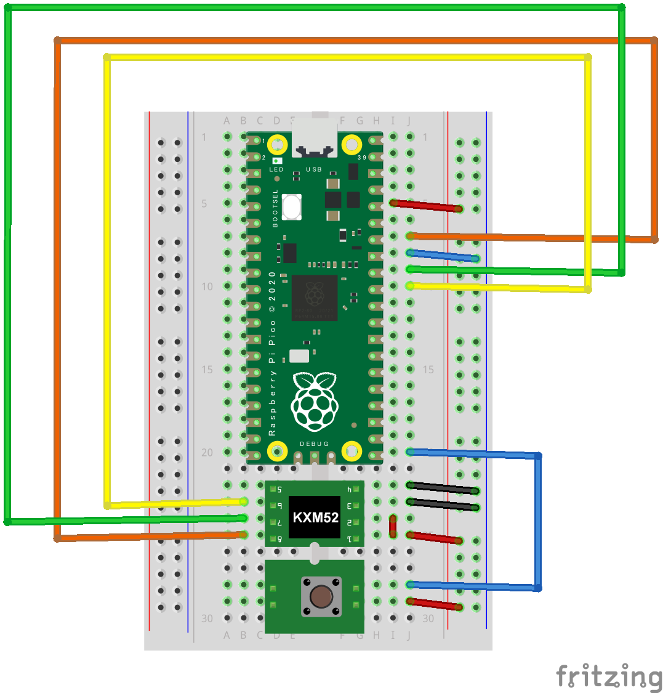

# Raspberry Pi Pico : Experiment Codes

CircuitPython 3D mouse sample code.

## Requirement

* RaspberryPi pico
* CircuitPython
* usb_hid module
* adafruit_hid module
* KXM52-1050 (製造終了) -> KXM92-2050
  https://akizukidenshi.com/catalog/g/gM-05153/
* タクトスイッチ
  https://akizukidenshi.com/catalog/g/gP-03648/

## Usage

## Install

## Reference

[RaspberryPi Pico Setup:incmplt](https://www.incmplt.net/2022/09/10/raspberrypi-pico-setup/)

## Licence

[MIT](https://github.com/tcnksm/tool/blob/master/LICENCE)

## Author

* [incmplt](https://www.incmplt.net/)
* [Info Circus,Inc.](https://www.infocircus.jp/)
