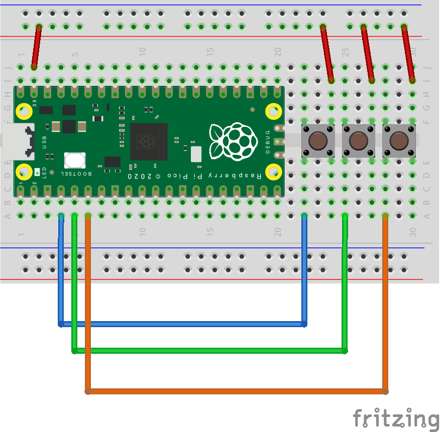

# CircuitPython HID sample.

## Requirement

* RaspberryPi pico
* CircuitPython
* usb_hid module
* adafruit_hid module
* タクトスイッチ
  https://akizukidenshi.com/catalog/g/gP-03648/

# Usage

タクトスイッチと、押したときの HIDエミュレーションは以下の通り。

| Pin | Comment |
|---|---|
| GP2 | タクトスイッチ / ALT + PrintScreen |
| GP3 | タクトスイッチ / Win + PrintScreen |
| GP4 | タクトスイッチ / ESCAPE |

以下のライブラリを使用する。

* [adafruit_hid.keyboard.Keyboard](https://docs.circuitpython.org/projects/hid/en/latest/api.html)
* [adafruit_hid.keycode.Keycode](https://circuitpython.readthedocs.io/projects/hid/en/latest/api.html#adafruit-hid-keycode-keycode)

今回のサンプルでは使用しないが、マウスのエミュレーションなどのライブラリも存在する。

* [adafruit_hid.mouse.Mouse](https://circuitpython.readthedocs.io/projects/hid/en/latest/api.html#adafruit-hid-mouse-mouse)
* [adafruit_hid.consumer_control.ConsumerControl](https://circuitpython.readthedocs.io/projects/hid/en/latest/api.html#adafruit-hid-consumer-control-consumercontrol)
* [adafruit_hid.gamepad.Gamepad](https://circuitpython.readthedocs.io/projects/hid/en/3.1.3/api.html#adafruit-hid-gamepad-gamepad)

# Install

Circuit Python を RaspberryPi Picoにインストールする。

adafruit_hid のライブラリを、GitHub からダウンロードして lib 以下をRaspberryPi Pico にコピーする。

[adafruit_hid : GitHub](https://github.com/adafruit/Adafruit_CircuitPython_HID)

main.py をコピーして実行。

## Reference

[RaspberryPi Pico Setup:incmplt](https://www.incmplt.net/2022/09/10/raspberrypi-pico-setup/)

## Licence

[MIT](https://github.com/tcnksm/tool/blob/master/LICENCE)

## Author

* [incmplt](https://www.incmplt.net/)
* [Info Circus,Inc.](https://www.infocircus.jp/)
