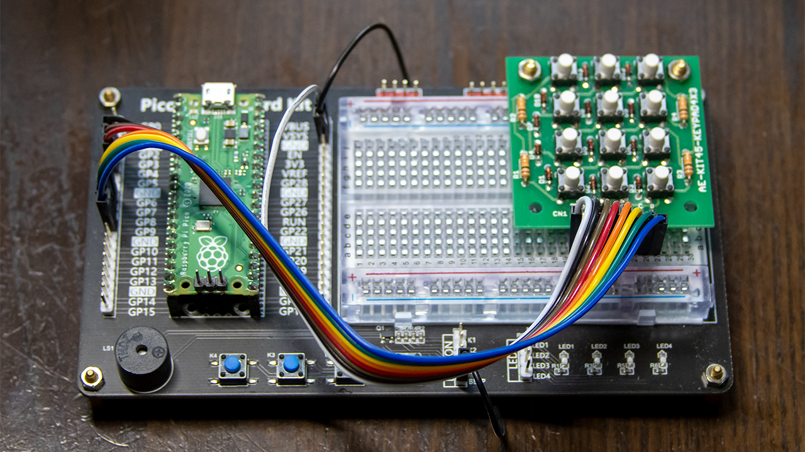
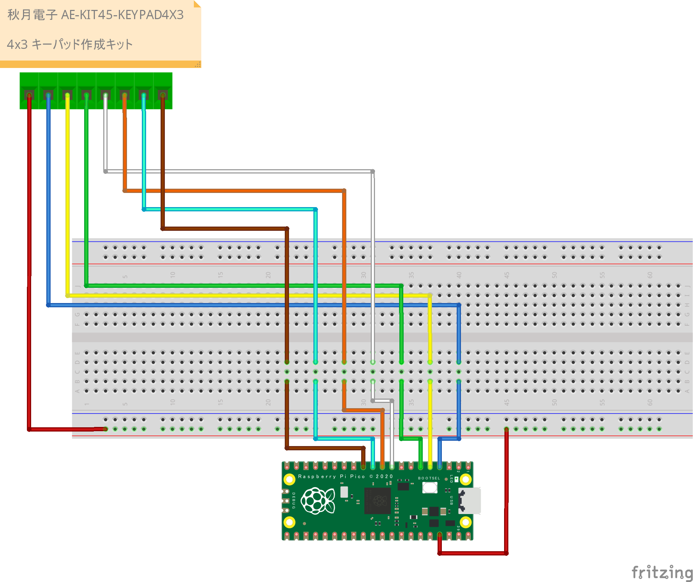

# Raspberry Pi Pico : AE-KIT45-KEYPAD4X3

## Requirement

* RaspberryPi Pico
* 秋月電子 4x3 キーパッド作成キット : [AE-KIT45-KEYPAD4X3](https://akizukidenshi.com/catalog/g/gK-12229/)

キーパッド4x3 のコネクターとPicoのインターフェースとの接続は以下の通り。

| keypad | Pico I/F | Pin # |
| :---: | :---: | :---: |
| ▽  | VSYS |  39 |
| X | GP2 | 4 |
| Y | GP3 | 5 |
| Z | GP4 | 6 |
| A | GP6 | 9 |
| B | GP7 | 10 |
| C | GP8 | 11 |
| D | GP9 | 12 |

別のGPIOに割り当てることも可能であるが、ケーブルの並びが良くないので、上記構成を推奨。

本サンプルプログラムは、縦列(4列側)の多重入力を検出できない。

## Reference

[RaspberryPi Pico Setup:incmplt](https://www.incmplt.net/2022/09/10/raspberrypi-pico-setup/)

## Licence

[MIT](https://github.com/tcnksm/tool/blob/master/LICENCE)

## Author

* [incmplt](https://www.incmplt.net/)
* [Info Circus,Inc.](https://www.infocircus.jp/)
