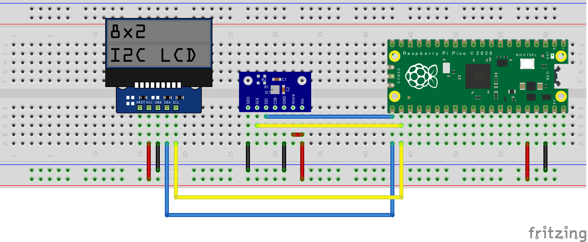

# Raspberry Pi Pico : ST7032 and BME280

## Requirement

* RaspberryPi Pico
* ST7032 : [AE-AQM0802+PCA9515](https://akizukidenshi.com/catalog/g/gK-11354/)
* BME280 : [AE-BME280](https://akizukidenshi.com/catalog/g/gK-09421/)

## Reference

[RaspberryPi Pico Setup:incmplt](https://www.incmplt.net/2022/09/10/raspberrypi-pico-setup/)

## Licence

[MIT](https://github.com/tcnksm/tool/blob/master/LICENCE)

## Author

* [incmplt](https://www.incmplt.net/)
* [Info Circus,Inc.](https://www.infocircus.jp/)
