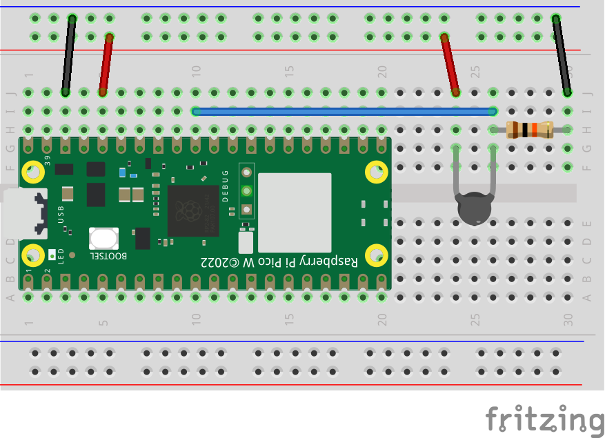

# Raspberry Pi Pico : 103JT-025/050 Thermistor

## Requirement

* RaspberryPi Pico
* 超薄型サーミスター 103JT-025 : [AE-AQM0802+PCA9515](https://akizukidenshi.com/catalog/g/g110160/)
* カーボン抵抗(炭素皮膜抵抗) 1/4W10kΩ : [カーボン抵抗(炭素皮膜抵抗) 1/4W10kΩ](https://akizukidenshi.com/catalog/g/g125103/)

## Reference

[RaspberryPi Pico Setup:incmplt](https://www.incmplt.net/2022/09/10/raspberrypi-pico-setup/)

## Licence

[MIT](https://github.com/tcnksm/tool/blob/master/LICENCE)

## Author

* [incmplt](https://www.incmplt.net/)
* [Info Circus,Inc.](https://www.infocircus.jp/)